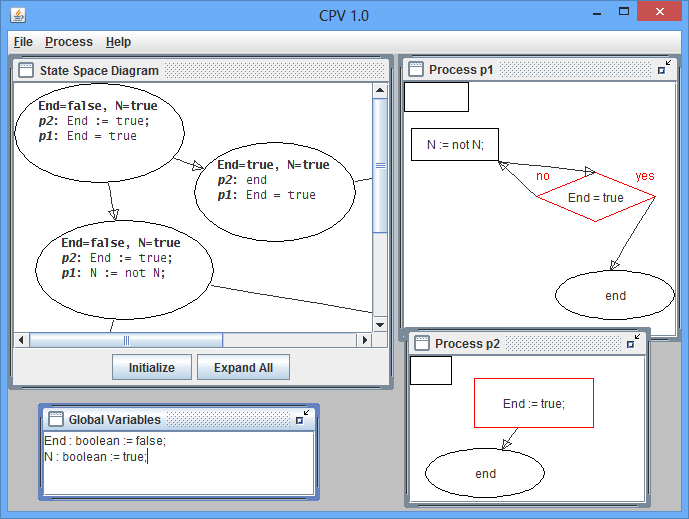

# CPV  &mdash; Concurrent Program Verifier

The purpose of CPV software is verification of concurrent programs. Designing and debugging an ordinary sequential program is already nontrivial task, and it is even more difficult to deal with concurrent programs. Concurrent Program Verifier can help you to understand the nature of concurrent programming, to play with concurrent behavior and, possibly, to avoid some common obstacles in real projects.

Concurrent Program Verifier is not an enterprise-level system; it is designed for educational purposes only. CPV allows you to perform two basic tasks:

* to develop your own concurrent program using a built-in flowchart editor;
* to analyze its behavior by means of special state space diagram builder.

We use flowcharts to create concurrent programs instead of a conventional text-based programming language. Our flowchart editor gives an ability to formulate basic statements, such as assignments, conditionals and semaphore operations (which seems to be enough for simple educational programs).

State space diagram is a standard way to describe a behavior of a program (both single-threaded and concurrent). Having such a diagram, you can easily analyze possible workflows and test your program for correctness.

Make sure to check detailed documentation in the `doc` subdirectory.

## Programming in CPV

When you create a new program by selecting `File/New`, a window will appear for declarations of global variables. CPV uses Pascal-like syntax for variable declaration, except that integer variables must include bounds, and all variables must have initial values. Only one declaration per line is allowed. To facilitate correct declarations of variables you can access templates by right-clicking within the variables frame.

To add a new process, select `Process/New` and type the name of the process. A frame for local variable declarations will popup; it works similarly to the global variable frame. When you have entered the variables, select `OK`; if no local variables are needed, select `Cancel`. The process frame includes a title bar with the process name, a box with the variable in the upper left-hand corner; the rest of the frame is used for the operations of the process.

The operations of the process are built as a flowchart. There are four types of nodes that can be created by right-clicking and selecting from the pop-up menu: assignment, semaphore operation, branching and end. Except for end nodes, an input dialog box is displayed in which you enter the text of the node; the text in a node can be modified by double-clicking the node. Nodes can be moved and resized in usual way. To remove a node, select it and
press `Del`.

The expression on the right-hand side of an assignment can be: a value, a variable, a unary `not` expression of a Boolean value or variable, a binary integer expression with `+` or `-`, or a binary Boolean expression with `or` or `and`. Semaphore operation nodes can be `wait(S)` or `signal(S)`. Branch nodes accept
binary expressions with values or variables; `=` and `<>` can be used with Boolean or integer types and `<`, `>`, `<=` and `>=` can be used with integer types. There can be at most one end node in each process.

To create arrows between nodes, move the cursor to a snap point of the source node (the yes and no corners of a branching operation and the center of other operations). The cursor will be changed to hand. While holding down the left mouse button, move the cursor to a snap point on the target node and release the button.

It is possible to create segmented arrows: `Shift+left-click` on an arrow to add or remove a moveable junction.

Exactly one block in each process must be marked as the start block:
right-click and select `Mark As Starting`.

## Creating State Diagrams

A state of a concurrent program consists of a vector whose elements are the instruction pointers of all processes and the values of all the variables, both global and local. A state diagram shows all the possible states of the concurrent program, and every path through the diagram is a possible scenario of the execution of the program. Select `Initialize` to start the construction of the state diagram. You can construct the entire diagram by selecting `Expand All`, or you can construct the diagram incrementally by double-clicking on
any state.

## Building and running CPV

For building, use `build.bat`. The current version of CPV was created for Java 1.4 (released in 2002) and uses a third-party component JGraph v2.1 (included into the package as `jgraph.jar`). This version of JGraph is incompatible with modern Java, so a [newer release](https://github.com/jgraph/jgraphx) should be tested with CPV eventually.

Use `run.bat` to run CPV.

## Licensing
Copyright 2002, 2003 by Maxim Mozgovoy and Mordechai (Moti) Ben-Ari.

This software uses:
JGraph, Copyright 2001 by Gaudenz Alder under the GNU Lesser Public License.
The source code of JGraph is obtainable from www.jgraph.org.

This program is free software; you can redistribute it and/or
modify it under the terms of the GNU General Public License
as published by the Free Software Foundation; either version 2
of the License, or (at your option) any later version.

This program is distributed in the hope that it will be useful
but WITHOUT ANY WARRANTY; without even the implied warranty of
MERCHANTABILITY or FITNESS FOR A PARTICULAR PURPOSE.
See the GNU General Public License for more details.

You should have received a copy of the GNU General Public License
along with this program; if not, write to the Free Software
Foundation, Inc., 59 Temple Place - Suite 330, Boston, MA
02111-1307, USA.